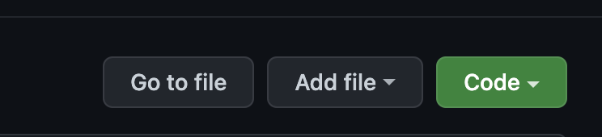
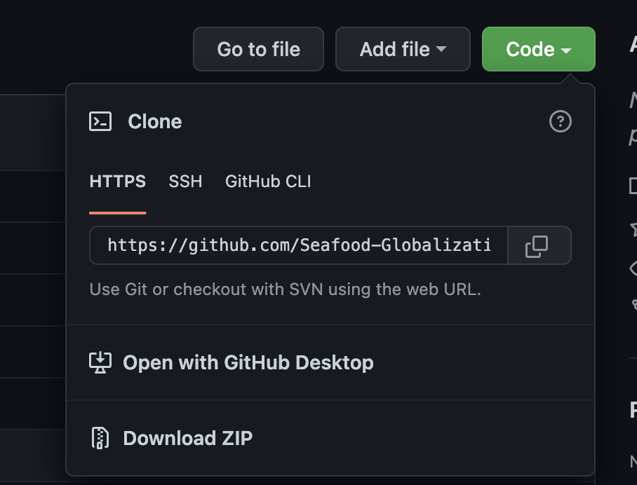
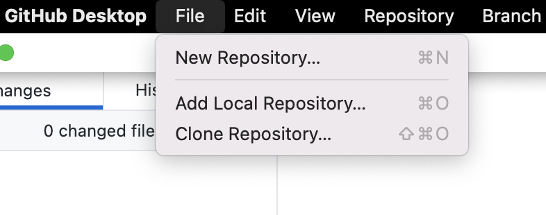
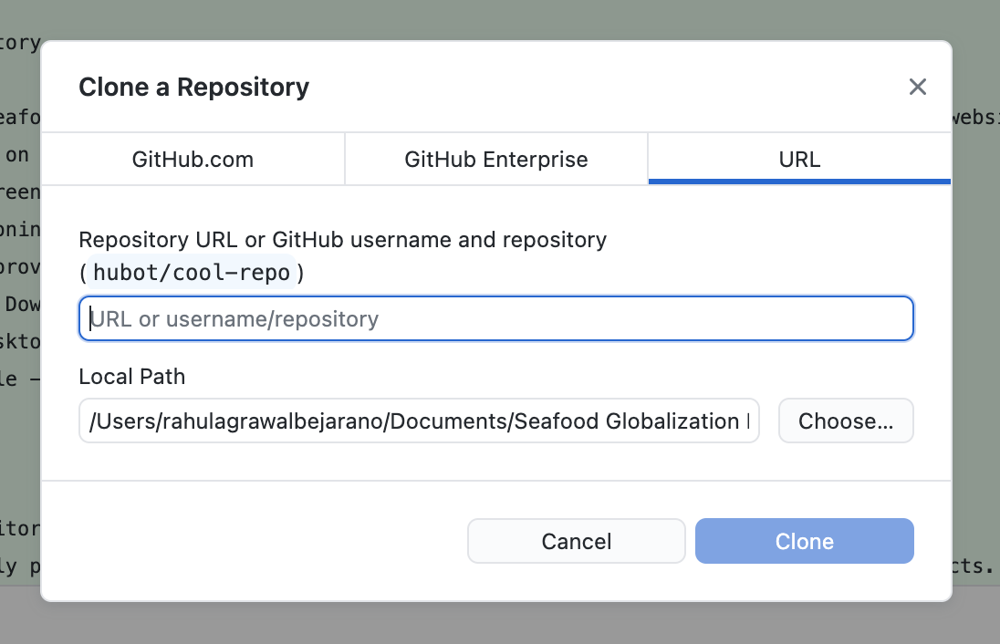
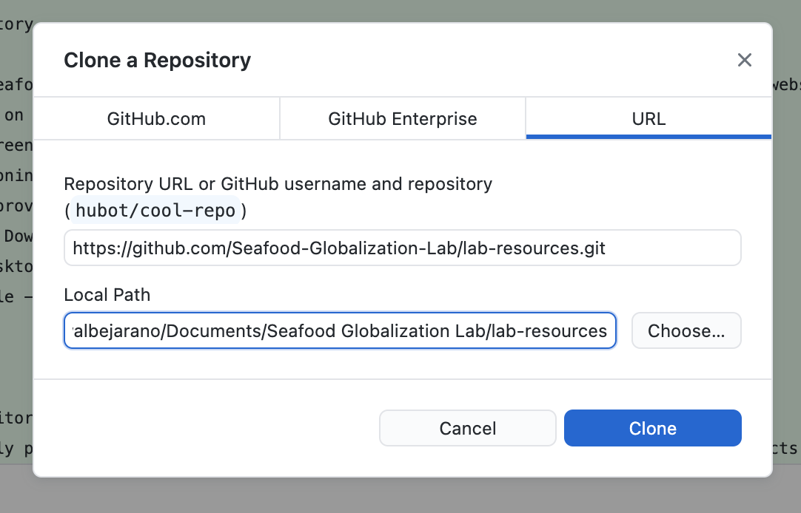
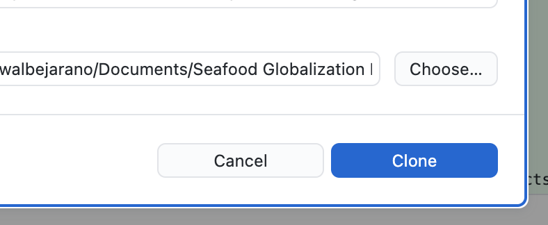
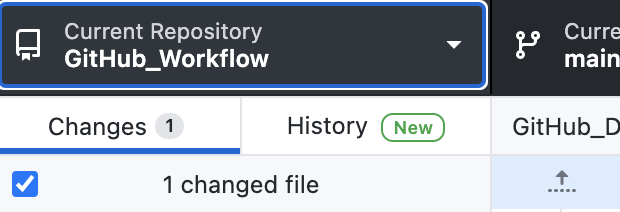
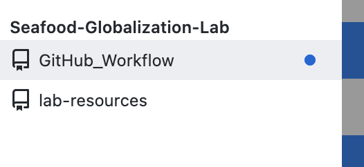
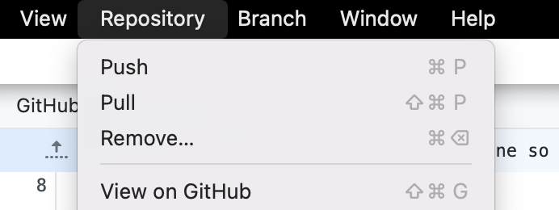

# GitHub Desktop Instructions

## Getting Started

This is a guide to help you use GitHub Desktop (which can be [downloaded here](https://desktop.github.com/)). This is an application that will help you work with the lab's GitHub repositories.

If you haven't done so already please create a [Github account](https://github.com/) and download [GitHub Desktop](https://desktop.github.com/).

## Clone a Repository

1. Navigate to [Seafood Globalization Lab](https://github.com/Seafood-Globalization-Lab) GitHub website
2. Find and click on the repository that you will be working with
3. Click on the green code button on the left hand side of the screen

4. Copy the link provided under the HTTPS tab of the drop down menu that appears

5. Open GitHub Desktop
6. Navigate to File --> Clone Repository

7. Paste Repository URL into URL field

8. Choose where you want this folder to live on your computer

9. Click Clone (This might take a few moments if the folder is particularly large, but for most cases will take just a few seconds)

  

## Getting Updates to a Repository

To get the most up to date code and data living in the repository, GitHub has a feature called Pull. This will 'pull' all the changes made in the remote copy of the repository into your local computer copy of the repository.

1. Open GitHub Desktop
2. Navigate and click the Current Repository drop down (on the top right hand side)

3. Select the repository you want to update
 
4. Navigate and click Repository --> Pull

## FAQs
- What is a repository?
   - This is simply put a folder where we will keep code and data that will be used in our projects.
